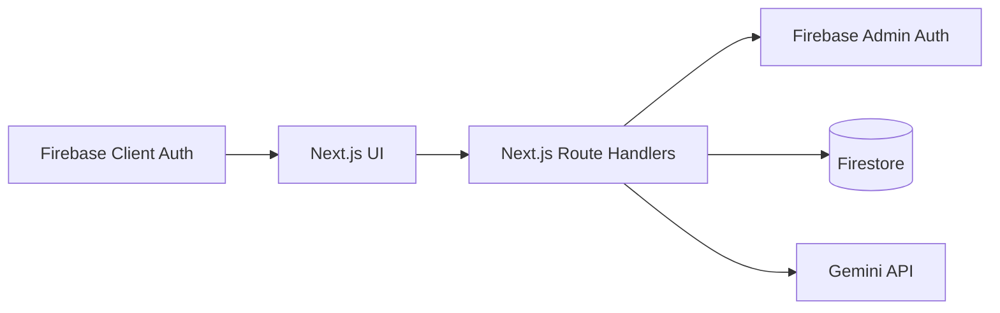
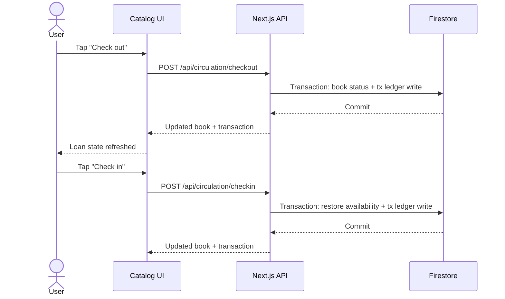
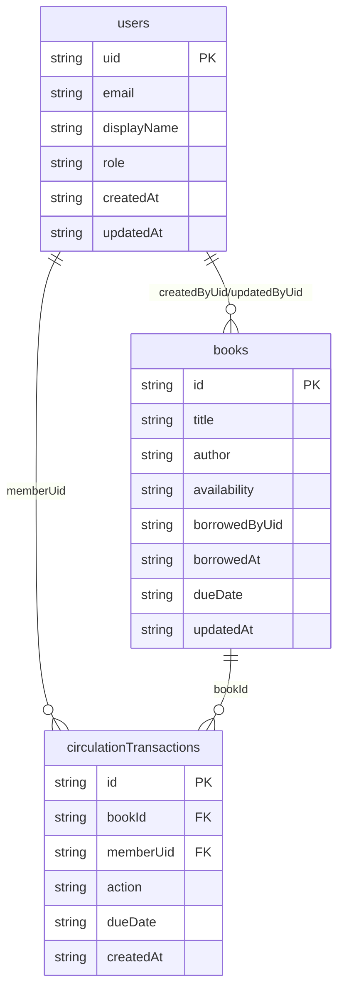

# Mini Library Management System (Version 1)

[](https://github.com/Mohammad-AlBaker-Zaytoun/Version-1--Mini-Library-Management-System-Challenge/actions/workflows/ci.yml)

Interview-focused, incremental implementation of a mobile-first library platform built with Next.js, Firebase, and practical AI features.

Current status: **PR15 SEO + README Polish**.

## Goals

- Build in small, reviewable PRs.
- Keep code production-minded from day one.
- Prioritize responsive UX (mobile-first).
- Enforce authentication, RBAC, and API validation.
- Add practical AI features without leaking secrets.

## Stack

- Next.js App Router + TypeScript strict (no `src/`)
- Tailwind CSS
- Firebase Auth (Google SSO) + Firestore
- Gemini API (server-side usage only)
- Vercel deployment target
- pnpm package manager

## Implemented Features

- Authentication and RBAC:
  - Google SSO login/logout
  - session cookie sync
  - protected routes via `proxy.ts`
  - protected page group layout for authenticated screens
  - roles: `admin`, `member`
- Book management:
  - admin CRUD at `/admin/books`
  - validation via Zod
  - audit fields + normalized search metadata
- Catalog:
  - search by title/author/genre/tags
  - availability + overdue filters
  - URL-synced query state and pagination
  - checkout/checkin actions with lock/loading states
  - modular catalog components (`catalog-client`, `search-filters`, `book-grid`)
- Circulation:
  - checkout/checkin API workflows
  - immutable transaction ledger (`circulationTransactions`)
  - self-only member restrictions with admin overrides
- Analytics:
  - `/api/analytics/overview?range=3|6|12`
  - role-scoped dashboard metrics
  - overdue pressure, utilization, monthly checkout/checkin charts
  - modular dashboard components (`analytics-client`, `analytics-cards`, chart modules)
- AI features:
  - admin metadata enrichment endpoint (`POST /api/ai/enrich-book`)
  - AI summary + genre + tag suggestions in admin book form
  - strict output validation with fallback response mode
  - dashboard AI operations brief (`POST /api/dashboard/ai-overview`)
  - catalog AI next-book recommendation (`POST /api/catalog/ai-recommendation`)
- SEO baseline:
  - metadata + OpenGraph/Twitter
  - canonical routes
  - `app/sitemap.ts`
  - `app/robots.ts`

## Architecture



## Core Sequence



## Data Model



## API Surface

| Method   | Endpoint                         | Access        | Purpose                                              |
| -------- | -------------------------------- | ------------- | ---------------------------------------------------- |
| `GET`    | `/api/books`                     | Authenticated | Search/filter/paginate catalog                       |
| `POST`   | `/api/books`                     | Admin         | Create book                                          |
| `GET`    | `/api/books/:id`                 | Authenticated | Read one book                                        |
| `PATCH`  | `/api/books/:id`                 | Admin         | Update book                                          |
| `DELETE` | `/api/books/:id`                 | Admin         | Delete book                                          |
| `POST`   | `/api/circulation/checkout`      | Authenticated | Borrow a book                                        |
| `POST`   | `/api/circulation/checkin`       | Authenticated | Return a book                                        |
| `GET`    | `/api/circulation/history`       | Authenticated | Circulation timeline                                 |
| `POST`   | `/api/ai/enrich-book`            | Admin         | AI metadata enrichment                               |
| `GET`    | `/api/analytics/overview`        | Authenticated | Dashboard metrics (`range=3,6,12`)                   |
| `POST`   | `/api/dashboard/ai-overview`     | Authenticated | AI summary and recommendations for dashboard metrics |
| `POST`   | `/api/catalog/ai-recommendation` | Authenticated | AI next-book suggestion based on member history      |

## Branch / PR Strategy

1. `chore/01-foundation-readme-env`
2. `feat/02-ui-shell-seo`
3. `feat/03-firebase-auth-rbac`
4. `feat/04-books-crud`
5. `feat/05-search-filters`
6. `feat/06-circulation-checkin-checkout`
7. `feat/07-ai-catalog-assistant`
8. `feat/08-overdue-analytics`
9. `chore/09-quality-ci-readme-final`
10. `chore/10-firestore-seeding`
11. `feat/11-dashboard-catalog-ai-insights`
12. `feat/12-protected-layout-app-shell`
13. `refactor/13-dashboard-componentization`
14. `refactor/14-catalog-componentization`

## Environment Variables

Copy `.env.example` to `.env.local`:

```bash
cp .env.example .env.local
```

| Variable                                   | Required | Description                               |
| ------------------------------------------ | -------- | ----------------------------------------- |
| `NEXT_PUBLIC_APP_URL`                      | Yes      | Base URL (local: `http://localhost:3000`) |
| `NEXT_PUBLIC_FIREBASE_API_KEY`             | Yes      | Firebase web API key                      |
| `NEXT_PUBLIC_FIREBASE_AUTH_DOMAIN`         | Yes      | Firebase auth domain                      |
| `NEXT_PUBLIC_FIREBASE_PROJECT_ID`          | Yes      | Firebase project id                       |
| `NEXT_PUBLIC_FIREBASE_STORAGE_BUCKET`      | Yes      | Firebase storage bucket                   |
| `NEXT_PUBLIC_FIREBASE_MESSAGING_SENDER_ID` | Yes      | Firebase sender id                        |
| `NEXT_PUBLIC_FIREBASE_APP_ID`              | Yes      | Firebase app id                           |
| `FIREBASE_PROJECT_ID`                      | Yes      | Firebase Admin project id                 |
| `FIREBASE_CLIENT_EMAIL`                    | Yes      | Firebase Admin service account email      |
| `FIREBASE_PRIVATE_KEY`                     | Yes      | Firebase Admin private key (`\n` escaped) |
| `GEMINI_API_KEY`                           | Yes      | Gemini API key (server-side only)         |

## Local Development

```bash
pnpm install
pnpm dev
```

Open `http://localhost:3000`.

## Promote a User to Admin

After signing in once:

```bash
pnpm bootstrap-admin --email=you@example.com
# or
pnpm bootstrap-admin --uid=YOUR_FIREBASE_UID
```

## Database Seeding

Seeding is **destructive** and resets Firestore collections before inserting deterministic demo data:

- `circulationTransactions`
- `books`
- `users`

Recommended command (preserves your own admin access after reset):

```bash
pnpm seed:demo --admin-email=your-google-email@example.com
```

Available modes:

```bash
pnpm seed:demo
pnpm seed:demo --dry-run
pnpm seed:demo --admin-email=you@example.com
pnpm seed:demo --force --admin-email=you@example.com
pnpm seed:demo:force --admin-email=you@example.com
```

Safety guard behavior:

- By default, seeding is allowed only when `FIREBASE_PROJECT_ID` contains one of `test`, `dev`, `staging`, `sandbox`, `demo`.
- Use `--force` only when you intentionally want to seed a non-test project.
- `--admin-email` must resolve to an existing Firebase Auth user, otherwise the command fails.

## Testing and Quality

```bash
pnpm lint
pnpm typecheck
pnpm test
pnpm build
```

Playwright e2e happy-path smoke:

```bash
pnpm test:e2e:install
pnpm test:e2e
```

Testing coverage in this version:

- Unit: validators, guards, search behavior.
- Integration: key API route handlers.
- E2E: login/SSO entry happy path.

## CI

GitHub Actions workflow: `.github/workflows/ci.yml`

Runs on PRs and `main` pushes:

- `pnpm lint`
- `pnpm typecheck`
- `pnpm test`
- `pnpm build`

## Firestore Indexes

Current index:

- `books`: `availability` (ASC) + `updatedAt` (DESC)

Deploy:

```bash
firebase deploy --only firestore:indexes
```

## Vercel Deployment Checklist

1. Create a Vercel project linked to this repository.
2. Set all environment variables from the table above in Vercel Project Settings.
3. Ensure production `NEXT_PUBLIC_APP_URL` matches your Vercel domain.
4. Confirm Firebase Auth authorized domains include your Vercel domain.
5. Deploy and verify:
   - `/login` Google sign-in
   - `/catalog` search/filter + circulation actions
   - `/history` timeline
   - `/dashboard` analytics data
   - `/admin/books` CRUD + AI enrichment

## Demo Script (Interview)

1. Sign in as admin.
2. Go to `/admin/books`, create a book, run "Enrich with AI", save.
3. Open `/catalog`, find the new book, checkout and checkin it.
4. Open `/history`, show immutable checkout/checkin entries.
5. Open `/dashboard`, toggle `3M/6M/12M`, explain utilization and overdue pressure.
6. Sign in as member and show role-scoped differences.
7. Open `/robots.txt` and `/sitemap.xml` to confirm SEO artifacts are published.

## Known Limitations (v1)

- Firestore querying is optimized for demo-scale data; larger datasets need deeper index/query tuning.
- E2E suite currently covers a smoke happy path; full multi-user end-to-end flows can be expanded.
- AI enrichment fallback is deterministic but intentionally simple compared with richer model pipelines.
