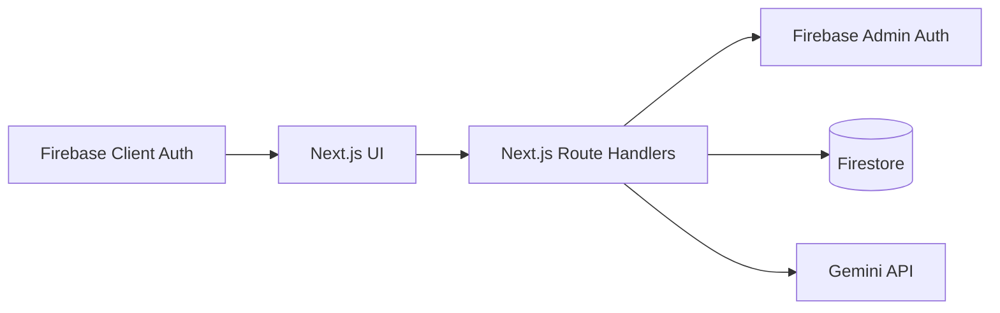

# Mini Library Management System (Version 1)

Incremental, interview-focused project scaffold for building a mobile-first library platform with Next.js + Firebase + AI.

Current status: **PR3 Firebase auth + RBAC scaffold** (Google SSO, secure session cookie flow, protected routes, role-aware admin access).

## Goals

- Build in small, reviewable PRs.
- Keep architecture production-minded from day one.
- Prioritize mobile-first UX and clean engineering practices.

## Planned Stack

- Next.js App Router + TypeScript strict (no `src/`)
- Tailwind CSS
- Firebase (Auth + Firestore)
- Gemini API features
- Vercel deployment

## Current Scope (PR3)

- Next.js project initialized
- Tailwind CSS + global theme tokens
- TypeScript strict config
- ESLint + Prettier setup
- `.env.example` contract added
- Mobile-first app shell and route scaffolds:
  - `/`
  - `/login`
  - `/catalog`
  - `/dashboard`
  - `/history`
- Authentication and authorization scaffold:
  - Firebase client/admin wiring
  - Google SSO sign-in and sign-out
  - Session cookie API (`/api/auth/session`)
  - User profile sync API (`/api/auth/sync`)
  - route protection middleware (`proxy.ts`)
  - server-side protected page checks
  - role-aware admin route (`/admin`)
  - admin role bootstrap script (`pnpm bootstrap-admin --email=you@example.com`)
- SEO baseline:
  - root and per-page metadata
  - OpenGraph/Twitter cards
  - canonical tags
  - `app/robots.ts`
  - `app/sitemap.ts`
- README with architecture + branch strategy

## Architecture (Target)



## Branch and PR Strategy

1. `chore/01-foundation-readme-env`
2. `feat/02-ui-shell-seo`
3. `feat/03-firebase-auth-rbac`
4. `feat/04-books-crud`
5. `feat/05-search-filters`
6. `feat/06-circulation-checkin-checkout`
7. `feat/07-ai-catalog-assistant`
8. `feat/08-overdue-analytics`
9. `chore/09-quality-ci-readme-final`
10. `chore/10-firestore-seeding`

## Environment Variables

Copy `.env.example` to `.env.local` and fill values:

```bash
cp .env.example .env.local
```

| Variable | Required | Description |
| --- | --- | --- |
| `NEXT_PUBLIC_APP_URL` | Yes | App base URL (`http://localhost:3000`) |
| `NEXT_PUBLIC_FIREBASE_API_KEY` | Yes | Firebase web app api key |
| `NEXT_PUBLIC_FIREBASE_AUTH_DOMAIN` | Yes | Firebase auth domain |
| `NEXT_PUBLIC_FIREBASE_PROJECT_ID` | Yes | Firebase project id |
| `NEXT_PUBLIC_FIREBASE_STORAGE_BUCKET` | Yes | Firebase storage bucket |
| `NEXT_PUBLIC_FIREBASE_MESSAGING_SENDER_ID` | Yes | Firebase sender id |
| `NEXT_PUBLIC_FIREBASE_APP_ID` | Yes | Firebase web app id |
| `FIREBASE_PROJECT_ID` | Yes | Firebase Admin project id |
| `FIREBASE_CLIENT_EMAIL` | Yes | Firebase Admin service account email |
| `FIREBASE_PRIVATE_KEY` | Yes | Firebase Admin private key (`\n` escaped) |
| `GEMINI_API_KEY` | Yes | Gemini API key |

## Local Development

```bash
pnpm install
pnpm dev
```

Open `http://localhost:3000`.

## Auth + RBAC Notes

- Protected pages:
  - `/catalog`
  - `/dashboard`
  - `/history`
  - `/admin` (admin-only)
- Unauthenticated requests are redirected to `/login`.
- Authenticated users visiting `/login` are redirected to `/catalog`.
- Role model:
  - `member`
  - `admin`

## Promote a User to Admin

After signing in once with Google:

```bash
pnpm bootstrap-admin --email=you@example.com
# or
pnpm bootstrap-admin --uid=YOUR_FIREBASE_UID
```

## Quality Commands

```bash
pnpm lint
pnpm typecheck
pnpm build
```
