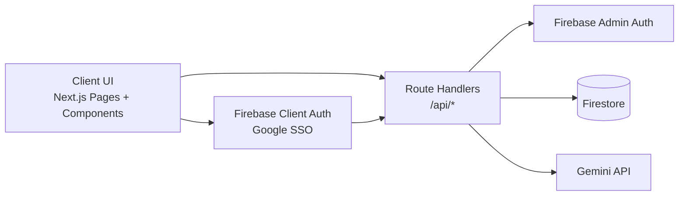
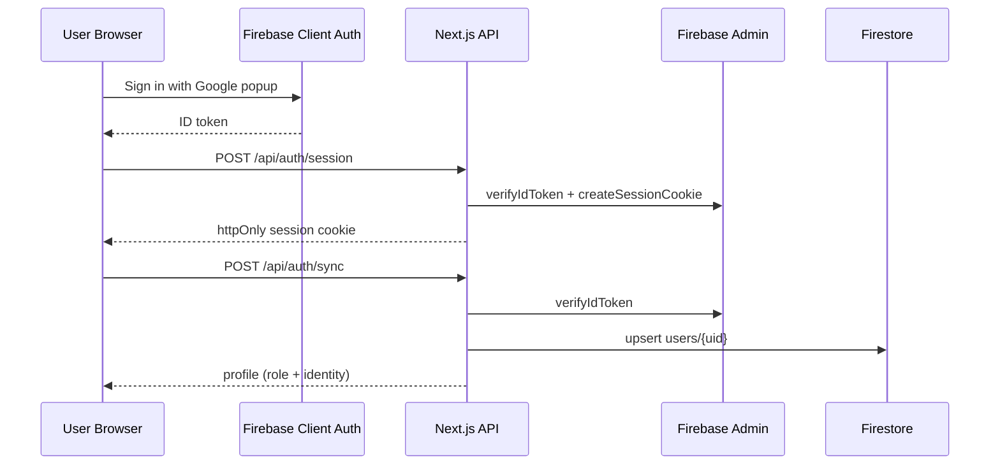
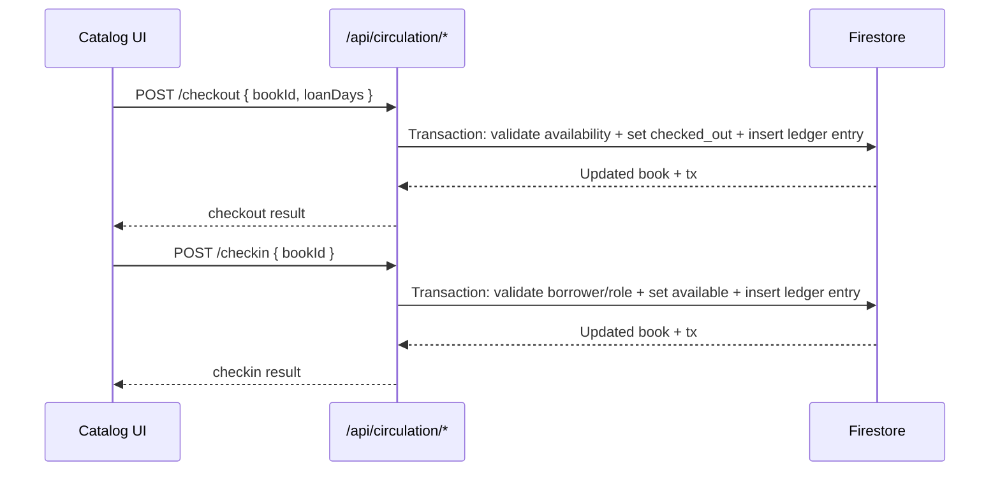
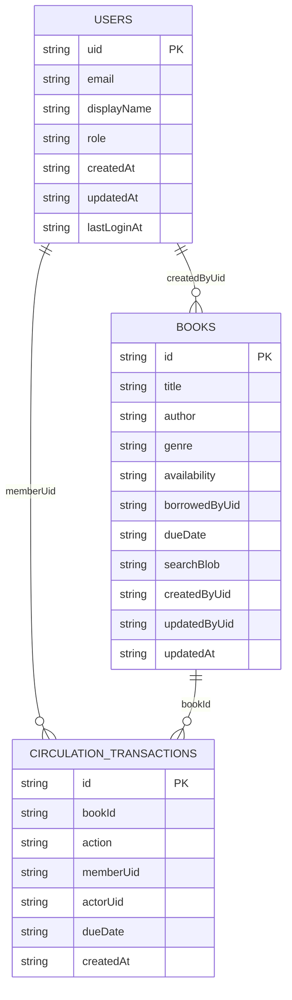

# Mini Library Management System (Version 1)

Interview-ready, mobile-first library platform built with Next.js App Router, Firebase Auth/Firestore, and Gemini AI.

Live URL: `TODO_ADD_VERCEL_URL`

## Table of Contents

- [What This Project Demonstrates](#what-this-project-demonstrates)
- [Features](#features)
- [Architecture](#architecture)
- [Data Model](#data-model)
- [Tech Stack](#tech-stack)
- [Project Structure](#project-structure)
- [Prerequisites](#prerequisites)
- [Firebase Setup](#firebase-setup)
- [Environment Variables](#environment-variables)
- [Local Development](#local-development)
- [Admin Role Bootstrap](#admin-role-bootstrap)
- [Database Seeding (Deterministic)](#database-seeding-deterministic)
- [API Reference](#api-reference)
- [Quality, Testing, and CI](#quality-testing-and-ci)
- [SEO](#seo)
- [Deployment (Vercel)](#deployment-vercel)
- [Branch and PR Strategy](#branch-and-pr-strategy)
- [Interview Demo Script](#interview-demo-script)
- [Known Limitations (v1)](#known-limitations-v1)

## What This Project Demonstrates

- Production-style App Router architecture with strict TypeScript.
- Firebase Google SSO session flow with server-side token verification.
- Role-based authorization (`admin`, `member`) and route/API guards.
- Full circulation lifecycle (checkout/checkin) with immutable history.
- AI features:
  - Admin metadata enrichment for book forms.
  - Dashboard AI operations brief from current analytics.
  - Catalog AI next-book recommendation personalized from user history.
- Deterministic Firestore seeding workflow for repeatable demos.

## Features

- Admin CRUD for books (create, edit, delete).
- Member/admin catalog browsing and search filters.
- Checkout/checkin with duplicate-checkout prevention.
- Overdue tracking and analytics dashboard with charts and tooltips.
- Mobile-first responsive UI and smooth loading/transition states.
- SEO baseline (`metadata`, canonical tags, `robots.txt`, `sitemap.xml`).

## Architecture



### Auth + Session + Profile Sync



### Circulation Lifecycle



## Data Model



## Tech Stack

- Next.js 16 (App Router, TypeScript strict, no `src/` directory)
- Tailwind CSS v4 + reusable component primitives
- Firebase Auth (Google provider) + Firestore
- Gemini API via `@google/genai`
- Vitest (unit/integration) + Playwright (e2e)
- GitHub Actions CI
- Vercel deployment target
- `pnpm` package manager

## Project Structure

```text
app/
  (protected)/
    admin/books/
    catalog/
    dashboard/
    history/
  api/
    ai/enrich-book
    analytics/overview
    auth/session
    auth/sync
    books
    books/[id]
    catalog/ai-recommendation
    circulation/checkin
    circulation/checkout
    circulation/history
    dashboard/ai-overview
  layout.tsx
  robots.ts
  sitemap.ts
components/
lib/
scripts/
tests/
e2e/
proxy.ts
```

## Prerequisites

- Node.js 20+
- pnpm 9+
- Firebase project with:
  - Authentication enabled (Google provider)
  - Firestore database created
  - Service account credentials (Admin SDK)
- Gemini API key

## Firebase Setup

1. Create a Firebase project.
2. Create a Web App in Firebase and copy config values.
3. Enable `Authentication -> Sign-in method -> Google`.
4. Create Firestore database (Native mode).
5. Add authorized auth domains:
   - `localhost`
   - your Vercel production domain (after deployment)
6. Create a service account key:
   - `Project settings -> Service accounts -> Generate new private key`
   - copy `project_id`, `client_email`, `private_key` into `.env.local` values.

Note: `FIREBASE_PRIVATE_KEY` must keep newline escapes (`\n`) in env format.

## Environment Variables

Copy `.env.example` to `.env.local` and fill all values:

```bash
cp .env.example .env.local
```

| Variable | Required | Description |
| --- | --- | --- |
| `NEXT_PUBLIC_APP_URL` | Yes | App base URL (`http://localhost:3000` in local) |
| `NEXT_PUBLIC_FIREBASE_API_KEY` | Yes | Firebase web config |
| `NEXT_PUBLIC_FIREBASE_AUTH_DOMAIN` | Yes | Firebase auth domain |
| `NEXT_PUBLIC_FIREBASE_PROJECT_ID` | Yes | Firebase project id |
| `NEXT_PUBLIC_FIREBASE_STORAGE_BUCKET` | Yes | Firebase storage bucket |
| `NEXT_PUBLIC_FIREBASE_MESSAGING_SENDER_ID` | Yes | Firebase sender id |
| `NEXT_PUBLIC_FIREBASE_APP_ID` | Yes | Firebase web app id |
| `FIREBASE_PROJECT_ID` | Yes | Firebase Admin project id |
| `FIREBASE_CLIENT_EMAIL` | Yes | Firebase Admin client email |
| `FIREBASE_PRIVATE_KEY` | Yes | Firebase Admin private key (escaped with `\n`) |
| `GEMINI_API_KEY` | Yes | Gemini API key |

## Local Development

```bash
pnpm install
pnpm dev
```

Open: `http://localhost:3000`

## Admin Role Bootstrap

Sign in once with Google first (so the profile exists), then promote your account:

```bash
pnpm bootstrap-admin --email=you@example.com
# or
pnpm bootstrap-admin --uid=YOUR_FIREBASE_UID
```

## Database Seeding (Deterministic)

The seed script performs a destructive reset of:

- `users`
- `books`
- `circulationTransactions`

and inserts deterministic demo data:

- 4 users
- 30 books
- 40 transactions
- 12 checked out books (5 overdue, 7 on-time)

### Commands

```bash
pnpm seed:demo
pnpm seed:demo --admin-email=your-google-email@example.com
pnpm seed:demo --dry-run --admin-email=your-google-email@example.com
pnpm seed:demo --force --admin-email=your-google-email@example.com
```

### Safety Guard

- By default, destructive seed is allowed only for project IDs containing:
  - `test`, `dev`, `staging`, `sandbox`, or `demo`
- Use `--force` only when you intentionally target another project id.

### Important

- Seeding does not create Firebase Auth users.
- `--admin-email` preserves your ability to access admin pages after reset by upserting your Firestore profile as admin.

## API Reference

### Authentication/session (internal flow)

| Method | Endpoint | Access | Purpose |
| --- | --- | --- | --- |
| POST | `/api/auth/session` | Public (token required in body) | Create secure session cookie from Firebase ID token |
| DELETE | `/api/auth/session` | Authenticated user | Clear session cookie |
| POST | `/api/auth/sync` | Public (token required in body) | Upsert user profile in `users/{uid}` |

### Books and search

| Method | Endpoint | Access | Purpose |
| --- | --- | --- | --- |
| GET | `/api/books` | Authenticated | List/search/paginate books |
| POST | `/api/books` | Admin | Create book |
| GET | `/api/books/:id` | Authenticated | Get single book |
| PATCH | `/api/books/:id` | Admin | Update book |
| DELETE | `/api/books/:id` | Admin | Delete book |

`GET /api/books` query params:

- `q` (title/author/genre/isbn/tags search)
- `author`
- `genre`
- `availability` (`available` or `checked_out`)
- `page` (default `1`)
- `limit` (default `10`, max `50`)

### Circulation

| Method | Endpoint | Access | Purpose |
| --- | --- | --- | --- |
| POST | `/api/circulation/checkout` | Member/Admin | Checkout a book |
| POST | `/api/circulation/checkin` | Member/Admin | Checkin a book |
| GET | `/api/circulation/history` | Authenticated | List immutable transaction history |

Notes:

- Members can only checkout/checkin for themselves.
- Admin can act for other users.
- Duplicate checkout on unavailable book is rejected.

### Analytics and AI

| Method | Endpoint | Access | Purpose |
| --- | --- | --- | --- |
| GET | `/api/analytics/overview` | Authenticated | Dashboard metrics (`totalBooks`, `activeLoans`, `overdueCount`, `monthlyCheckouts`) |
| POST | `/api/dashboard/ai-overview` | Authenticated | AI operational summary and recommendations |
| POST | `/api/ai/enrich-book` | Admin | AI metadata enrichment for book forms |
| POST | `/api/catalog/ai-recommendation` | Authenticated | Personalized next-book recommendation |

## Role Matrix

| Capability | Member | Admin |
| --- | --- | --- |
| View catalog / search | Yes | Yes |
| Checkout / checkin own loans | Yes | Yes |
| Checkout/checkin on behalf of others | No | Yes |
| Manage books (CRUD) | No | Yes |
| AI enrichment for book forms | No | Yes |
| Dashboard analytics | Scoped | Full |

## Quality, Testing, and CI

### Local Quality Commands

```bash
pnpm lint
pnpm typecheck
pnpm test
pnpm test:e2e
pnpm build
```

### CI Workflow

GitHub Actions: [`.github/workflows/ci.yml`](.github/workflows/ci.yml)

- Runs on pull requests and pushes to `main`
- Executes:
  - lint
  - typecheck
  - unit/integration tests
  - production build

## SEO

Implemented baseline SEO:

- Global metadata in `app/layout.tsx`
- Per-page metadata (`/login`, `/catalog`, `/dashboard`, `/history`, `/admin/books`)
- Canonical URLs via metadata `alternates`
- `app/robots.ts` for crawl rules + sitemap location
- `app/sitemap.ts` generating `/sitemap.xml`

## Deployment (Vercel)

1. Import repository into Vercel.
2. Add all env vars from `.env.example`.
3. Deploy.
4. In Firebase Auth, add your Vercel domain to authorized domains.
5. Verify:
   - `/robots.txt`
   - `/sitemap.xml`
   - Google SSO login in production

## Branch and PR Strategy

Use focused feature branches and small PRs:

1. `chore/01-foundation-readme-env`
2. `feat/02-ui-shell-seo`
3. `feat/03-firebase-auth-rbac`
4. `feat/04-books-crud`
5. `feat/05-search-filters`
6. `feat/06-circulation-checkin-checkout`
7. `feat/07-ai-catalog-assistant`
8. `feat/08-overdue-analytics`
9. `chore/09-quality-ci-readme-final`
10. `chore/10-firestore-seeding`

## Interview Demo Script

1. Sign in with Google as admin.
2. Open `Manage Books` and create/edit/delete one book.
3. Use AI enrichment in the admin form.
4. Go to `Catalog`, search/filter, checkout a book.
5. Open `History` and show immutable ledger entries.
6. Open `Dashboard` and show:
   - active loans
   - overdue count
   - trend charts with tooltips and range toggles
   - AI operations brief
7. Return to `Catalog` and show AI next-book recommendation.
8. Run `pnpm seed:demo --admin-email=<your-email>` to demonstrate repeatable state reset.

## Known Limitations (v1)

- Search is currently done on a bounded dataset (`limit(500)`) before in-memory filtering.
- Firestore security rules are intentionally locked down because access is mediated through server APIs.
- E2E coverage is intentionally light (single smoke flow) for this version.
- AI outputs use deterministic fallbacks when provider output is invalid/unavailable.
